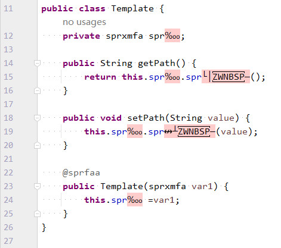
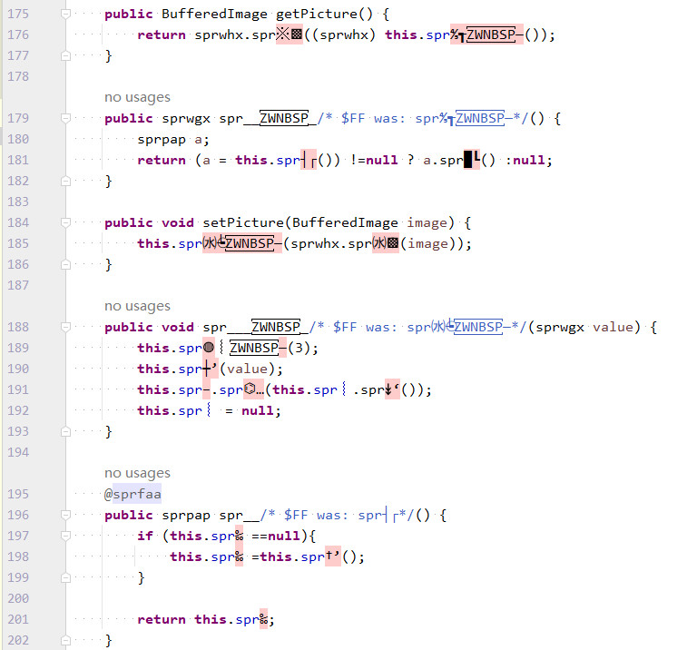
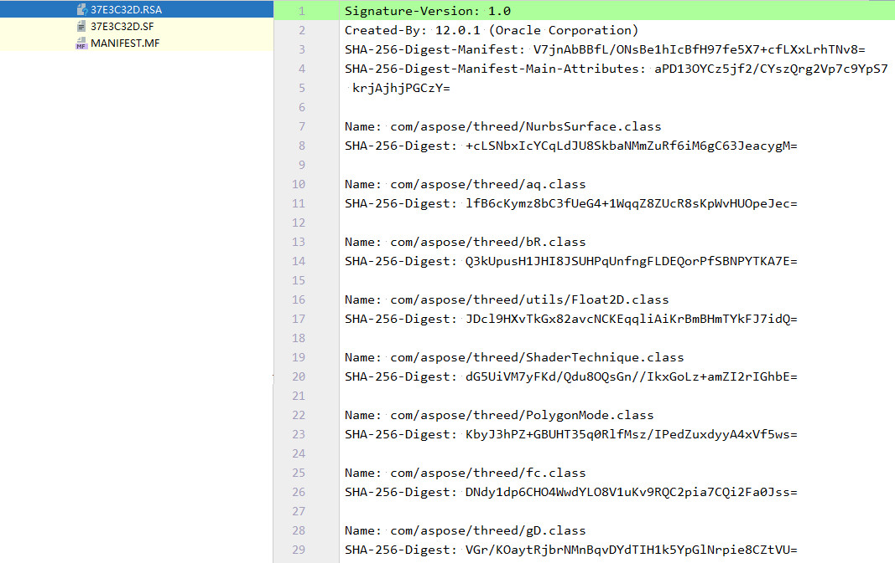
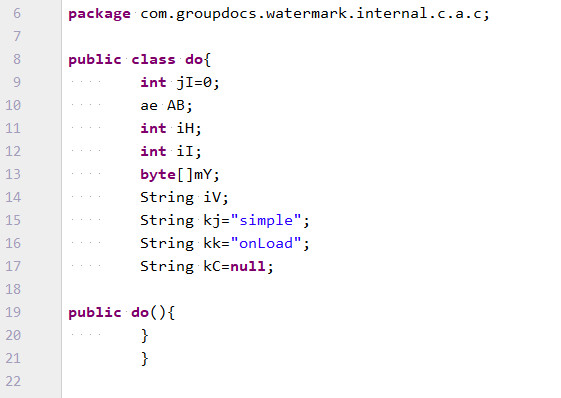
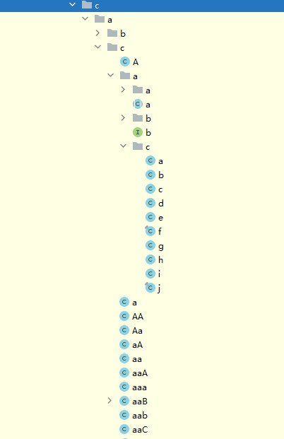
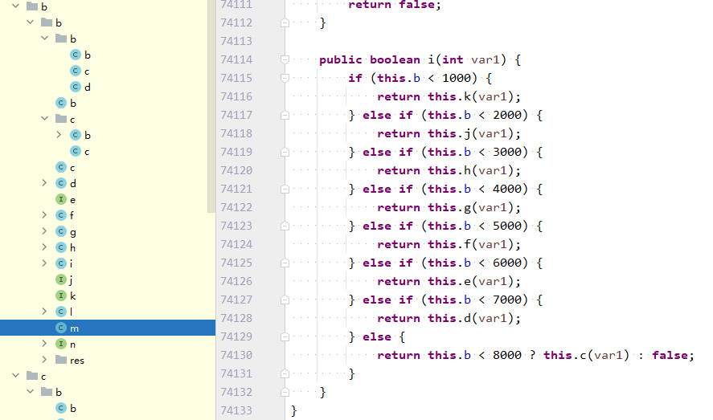
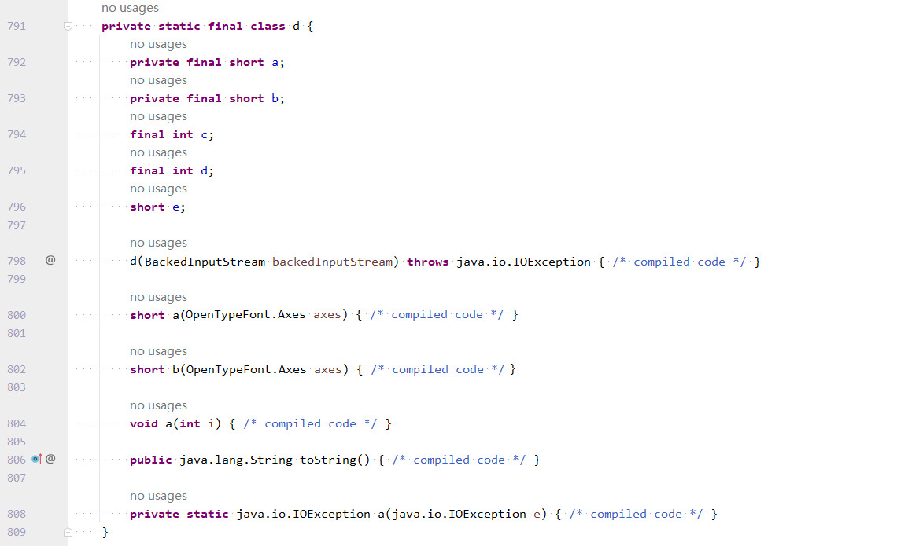

## 目录
#### 1. 商业软件安全防护
- [对外提供方式](#DWTGFS)
- [打包保护机制](#DBBHJZ)
- [JAR包来源](#JARBLY)
#### 2. 商业软件已科学列表
- [PDFjet](#PDFjet)
- [Aspose](#Aspose)
- [Aspose Total for JasperReports](#user-content-JasperReports)
- [GroupDocs](#GroupDocs)
- [Spire](#Spire)
- [DsExcel](#DsExcel)
- [Qoppa](#Qoppa)
- [Bfo](#Bfo)
- [PDFreactor](#PDFreactor)
- [IDRSolutions](#IDRSolutions)

## 1. 商业软件安全防护

##### 对外提供方式
>1. 按编程语言对外提供，对于多种编程语言提供不同的产品支持，如：.Net、Java、C++、Python等，每个编程语言提供一自有的实现，对于Java则是对外提供Jar文件；
>2. 按操作系统对外提供，分别提供Windows、Linux、MacOS平台的32和64位动态链接库文件，如Windows对应的dll；
>3. 按API账号提供（按接口前置机提供），部分也提供简单的API封装，所有功能交互均使用http接口访问，接口访问携带需授权的用户认证信息；

如果是第一种方式的实现，拿到一个纯本地的jar文件，那么`截至到目前为止我仍然认为Java写的商业产品（组件）是没有不能科学的`，因为本文种的数十款软件都已被科学实践掌握；  
第二种方式的动态链接库文件对我来说无解，无法掌握它们，就不存在对它们的科学实践了；  
第三种方式的接口交互表示实现程序在远端，更加无法掌握它们，仍然无法科学实践；  

##### 打包保护机制
不同的公司出的不同的产品功能不同、复杂程度不同，所以科学实现的难度也各不相同，分享几种复杂程度各不相同的复杂点：  
###### 特殊字符混淆
- class文件中包含了各种特殊字符，成员变量、方法等多处都使用了特殊字符参与，这些代码很难阅读，很大程度上起到保护的作用；  
- 不知道这种实现是如何做到的，但是可以肯定的是程序能够正常运行；  

###### RSA加密class
- 在jar文件的META-INF中存在一些RSA与SF文件，内部为一些class的SHA-256加密；  
- 在运行这些jar中的class时会检查class文件是否发生变化，如果变化就报错，删除这些文件虽然可以，但是那属于修改jar了；  

###### 常规混淆
- 类名为“do”是Java保留关键字；  
- 包名路径理论上不能存在重复，也就是说同一个名字不能即是包名，又是类名，但jar包中编译后的可以，参考如下图：  
  
- 类名不允许大小写不一致时的重复，也就是说：AA/Aa/aa/aA这4种命名只可以存在一种，但jar包种编译后的可以，参考如下图：  
  
- 一些jar文件特别大`100多MB`，一些class文件比较大`500多KB`，特别复杂，看到的class文件有7万多行，变相起到保护的作用，参考如下图：  
  
- 一些class文件做了更为科学的防护，打开提示`compiled code`，不知道里面的代码为何物，但不影响代码执行，需要使用更多的class打开工具查看，参考如下图：  
  

##### JAR包来源
- 由企业自己网maven中央仓库维护，定期更新版本，用户从中央仓库下载相关依赖（下载的无java sources）；
- 企业官网公开自己私服，用户从私服下载；
- 企业官网不含公共下载渠道，由用户提供联系方式（邮箱），从后续邮件交互中下载；

## 2. 商业软件已科学列表

### [PDFjet](https://www.pdfjet.com/index.html)</a>
PDFjet 是 PDFjet 软件的产品，非常轻量级的库，没有外部依赖。初于 2001 年开发，供内部使用。该软件已持续更新超过 23 年。   

- **PDFjet for Java** < 300 KB Java JAR  
- **PDFjet for .NET**  < 450 KB .NET DLL  

使用限制：文档水印  
科学难度：非常简单，一行代码即可  

### [Aspose](https://metrics.aspose.com/)
Aspose 是一家软件开发公司，提供众多屡获殊荣的 API，可供开发人员创建、编辑、转换或渲染 Office、OpenOffice、PDF、
图像、ZIP、CAD、XPS、EPS、PSD 以及其他众多文件格式。API 适用于不同的平台，包括 .NET、Java、C++、Python、PHP、Xamarin 和 Android，以及适用于 Microsoft SharePoint 
的报告解决方案，以及适用于 Microsoft SQL Server Reporting Services 和 JasperReports 的渲染扩展。超过 80% 的财富 100 强公司信赖 Aspose SDKs 在其应用程序中创建、
编辑、导出和转换 100 多种文件格式。

<table>
    <thead>
        <tr>
            <th>序号</th>
            <th>模块名称</th>
            <th>模块介绍</th>
        </tr>
    </thead>
    <tbody>
       <tr>
         <th>1</th>
         <td>aspose.cells（Excel）</td>
         <td>
            <ol>
                <li>提供了基于HTML代码转换为文档的示例，包含转换为：CSV、XLS、XLSX、PDF等</li>
                <li>提供了两种方式的科学使用（二选一，推荐后者）： 
                    （1）使用Javassist来改写特定的class代码，需要修改原始的jar； 
                    （2）使用反射调用特定的class代码逻辑，无需修改原始的jar； 
                </li>
                <li>科学使用的目的是转换后的文档无水印，可以支持超过4页的文档内容；</li>
                <li>科学使用的版本有<strong>23.10</strong>、<strong>24.4</strong>等；</li>
            </ol>
         </td>
       </tr>
       <tr>
         <th>2</th>
         <td>aspose.words（Word）</td>
         <td>
            <ol>
                <li>提供了基于HTML代码转换为文档的示例，包含转换为：DOC、DOCX、PDF、PNG等；</li>
                <li>提供了使用反射调用特定的class代码逻辑，无需修改原始的jar；</li>
                <li>科学使用的目的是转换后的文档无水印，可以支持超过4页的文档内容；</li>
                <li>科学使用的版本有<strong>23.10</strong>、<strong>24.4</strong>，网上可以找到一些更低版本的实践应用；</li>
            </ol>
         </td>
       </tr>
       <tr>
         <th>3</th>
         <td>aspose.pdf（PDF）</td>
         <td>
            <ol>
                <li>提供了基于HTML代码转换为PDF文档的简单示例；</li>
                <li>提供了两种方式的科学使用（二选一，推荐后者）： 
                    （1）使用Javassist来改写特定的class代码，需要修改原始的jar； 
                    （2）使用反射调用特定的class代码逻辑，无需修改原始的jar； 
                </li>
                <li>科学使用的目的是转换后的文档无水印，可以支持超过4页的文档内容；</li>
                <li>科学使用的版本有<strong>23.10</strong>、<strong>24.12</strong>，网上可以找到一些更低版本的实践应用；</li>
            </ol>
         </td>
       </tr>
       <tr>
         <th>4</th>
         <td>aspose.slides（PPT）</td>
         <td>
            <ol>
                <li>提供了将PPTX/PPTM等文件格式转换的简单示例，有转换为：SWF、GIF、PDF、HTML等格式；</li>
                <li>提供了使用反射调用特定的class代码逻辑，无需修改原始的jar；</li>
                <li>科学使用的目的是转换后的文档无水印，可以支持超过4页的文档内容；</li>
                <li>科学使用的版本有<strong>23.10</strong>；</li>
            </ol>
         </td>
       </tr>
       <tr>
         <th>5</th>
         <td>aspose.diagram（Visio）</td>
         <td>
            <ol>
                <li>提供了将VSD/VSDX等文件格式转换的简单示例，有转换为：PDF、HTML、GIF、XPS等格式；</li>
                <li>提供了使用反射调用特定的class代码逻辑，无需修改原始的jar；</li>
                <li>科学使用的目的是转换后的文档无水印，可以支持超过4页的文档内容；</li>
                <li>科学使用的版本有<strong>23.10</strong>、<strong>24.4</strong>；</li>
            </ol>
         </td>
       </tr>
       <tr>
         <th>6</th>
         <td>aspose.tasks（Project）</td>
         <td>
            <ol>
                <li>提供了将mpp等文件格式转换的简单示例，有转换为：PDF、SVG、PNG等格式；</li>
                <li>提供了使用反射调用特定的class代码逻辑，无需修改原始的jar；</li>
                <li>科学使用的目的是转换后的文档无水印，可以支持超过4页的文档内容；</li>
                <li>科学使用的版本有<strong>23.10</strong>；</li>
            </ol>
         </td>
       </tr>
       <tr>
         <th>7</th>
         <td>aspose.imaging（图像处理）</td>
         <td>
            <ol>
                <li>提供了将PNG格式图片转换为GIF、PDF、SVG等格式的简单示例；</li>
                <li>提供了使用反射调用特定的class代码逻辑，无需修改原始的jar；</li>
                <li>科学使用的版本有<strong>23.10</strong>；</li>
            </ol>
         </td>
       </tr>
       <tr>
         <th>8</th>
         <td>aspose.html</td>
         <td>
            <ol>
                <li>提供了将HTML文件格式转换的简单示例，有转换为：PDF、markdown、PNG等格式；</li>
                <li>提供了使用反射调用特定的class代码逻辑，无需修改原始的jar；</li>
                <li>科学使用的目的是转换后的文档无水印，可以支持超过4页的文档内容；</li>
                <li>科学使用的版本有<strong>23.10</strong>；</li>
            </ol>
         </td>
       </tr>
       <tr>
         <th>9</th>
         <td>aspose.zip</td>
         <td>
            <ol>
                <li>提供了将docx、png、txt等文件进行压缩，生成压缩包文件；</li>
                <li>提供了使用反射调用特定的class代码逻辑，无需修改原始的jar；</li>
                <li>科学使用的目的是可以正常压缩文件，若不科学的使用将会生成带水印的压缩包注释；</li>
                <li>科学使用的版本有当前最新版版本<strong>24.8</strong>；</li>
            </ol>
         </td>
       </tr>
       <tr>
         <th>10</th>
         <td>aspose.email</td>
         <td>
            <ol>
                <li>提供了将EML文件格式文件内容读取的示例，读取到了参数有：邮件ID、发送人、收件人、抄送人、密送人、标题、内容、附件、内联附件等等；</li>
                <li>提供了使用反射调用特定的class代码逻辑，无需修改原始的jar；</li>
                <li>科学使用的目的是读取到的数据无水印；</li>
                <li>科学使用的版本有<strong>23.10</strong>；</li>
            </ol>
         </td>
       </tr>
       <tr>
         <th>11</th>
         <td>aspose.note（笔记文件）</td>
         <td>
            <ol>
                <li>提供了将one格式的文件转换为PDF、PNG等其他格式类型文件；</li>
                <li>科学使用的目的是转换后的文档无水印，可以支持超过4页的文档内容；</li>
                <li>提供了使用反射调用特定的class代码逻辑，无需修改原始的jar；</li>
                <li>科学使用的版本有<strong>23.11</strong>；</li>
            </ol>
         </td>
       </tr>
       <tr>
         <th>12</th>
         <td>aspose.cad</td>
         <td>
            <ol>
                <li>提供了将dwg格式的文件转换为PDF、PNG等其他格式类型文件；</li>
                <li>科学使用的目的是转换后的文档无水印，可以支持超过4页的文档内容；</li>
                <li>提供了使用反射调用特定的class代码逻辑，无需修改原始的jar；</li>
                <li>科学使用的版本有<strong>23.10</strong>；</li>
            </ol>
         </td>
       </tr>
       <tr>
         <th>13</th>
         <td>aspose.3d</td>
         <td>
            <ol>
                <li>提供了生成将OBJ文件的示例，同时将其转换为：PDF、HTML、STL等格式的文件；</li>
                <li>提供了使用反射调用特定的class代码逻辑，无需修改原始的jar；</li>
                <li>科学使用的版本有<strong>23.10.0</strong>，不太懂这种3d格式的文件，转换为PDF也是空白，但是未科学使用前仍然是有水印的，科学使用后无水印（内容仍然是空白）；</li>
                <li>需要注意这个示例需要<strong style="color:red;">JDK9</strong>的最低版本；</li>
            </ol>
         </td>
       </tr>
       <tr>
         <th>14</th>
         <td>aspose.ocr</td>
         <td>
            <ol>
                <li>提供了识别PNG图片的示例，从图片中提取文本，并将其转换为：DOCX、PDF、JSON、XLSX等格式的文件；</li>
                <li>提供了使用反射调用特定的class代码逻辑，无需修改原始的jar；</li>
                <li>科学使用的版本有<strong>23.10.0</strong>、<strong>24.10.0</strong>、<strong>24.11.1</strong>，不科学的使用只会输出一小部分的文本，且会增加水印文本；</li>
                <li>24版本开始jar包精简了许多，提供了许多其他的外置语言包，需要自行放置在项目层级下的`aspose_data`目录内；</li>
                <li>需要注意这个示例需要<strong style="color:red;">JDK 64位</strong>的，因为使用到了`onnxruntime`库，内置了各种操作系统的“dll”库；</li>
            </ol>
         </td>
       </tr>
       <tr>
         <th>15</th>
         <td>aspose.psd</td>
         <td>
            <ol>
                <li>提供了将PSD文件转换为PNG、GIF、PDF等格式的简单示例；</li>
                <li>提供了使用反射调用特定的class代码逻辑，无需修改原始的jar；</li>
                <li>科学使用的版本有<strong>23.10</strong>；</li>
                <li>需要注意这个示例需要<strong style="color:red;">JDK8</strong>，并且需要设置最大运行内存如“-Xmx1024m”，否则提示内存溢出的错误；</li>
            </ol>
         </td>
       </tr>
       <tr>
         <th>16</th>
         <td>aspose.barcode</td>
         <td>
            <ol>
                <li>提供了生成条形码图片的简单示例；</li>
                <li>提供了使用反射调用特定的class代码逻辑，无需修改原始的jar；</li>
                <li>科学使用的版本有<strong>23.10</strong>；</li>
            </ol>
         </td>
       </tr>
       <tr>
         <th>17</th>
         <td>aspose.page</td>
         <td>
            <ol>
                <li>提供了将xps格式的文件转换为PDF（34页）、PNG（共34张图片）等其他格式类型文件；</li>
                <li>科学使用的目的是转换后的文档无水印，可以支持超过4页的文档内容；</li>
                <li>提供了使用反射调用特定的class代码逻辑，无需修改原始的jar；</li>
                <li>科学使用的版本有<strong>23.10</strong>；</li>
            </ol>
         </td>
       </tr>
       <tr>
         <th>18</th>
         <td>aspose.omr（光学标记识别）</td>
         <td>
            <ol>
                <li>扫描答题卡，可以是图片等多种格式的源文件；</li>
                <li>提供了解析OMR、JPG等文件进行解析，得到CSV、JSON等格式的解析结果；</li>
                <li>提供了使用反射调用特定的class代码逻辑，无需修改原始的jar；</li>
                <li>科学使用的版本有<strong>23.11</strong>；</li>
                <li>需要注意这个示例的执行是在控制台输出解析文件的文本，未科学使用只能够得到<strong style="color:red;">5</strong>道题目的解析结果；</li>
            </ol>
         </td>
       </tr>
       <tr>
         <th>19</th>
         <td>aspose.pub（名片/海报）</td>
         <td>
            <ol>
                <li>提供了将pub格式的文件转换为PDF格式类型文件；</li>
                <li>提供了使用反射调用特定的class代码逻辑，无需修改原始的jar；</li>
                <li>科学使用的版本有<strong>22.8</strong>；</li>
            </ol>
         </td>
       </tr>
       <tr>
         <th>20</th>
         <td>aspose.font</td>
         <td>
            <ol>
                <li>提供了将ttf格式的文件转换为svg、woff、ttf等其他格式类型文件；</li>
                <li>提供了将otf格式的文件生成文文本输出到jpg格式图片的示例；</li>
                <li>提供了将pfb格式的文件生成文文本输出到jpg格式图片的示例；</li>
                <li>一些示例并不需要来科学的使用，这些格式的文件也属实不知道使用在哪里，哪里需要去科学，上述两个示例如果使用到了第三方字体会报错“LicenseRestrictionException”，科学使用则不会；</li>
                <li>提供了使用反射调用特定的class代码逻辑，无需修改原始的jar；</li>
                <li>科学使用的版本有<strong>23.10</strong>；</li>
            </ol>
         </td>
       </tr>
       <tr>
         <th>21</th>
         <td>aspose.tex</td>
         <td>
            <ol>
                <li>提供了以ltx格式的文件为模版，转换为png格式的图片文件，可以理解成从特殊的文本格式生成富文本的图片；</li>
                <li>示例比较特殊必须实用<strong>main函数</strong>运行，不能使用@Junit，因为示例中包含了从控制台的键盘输入文本；</li>
                <li>示例搭配了xps文件，需要从控制台输入“sample.xps”后执行输出将会得到：sample.aux、sample.log、sample.png等文件；</li>
                <li>科学使用的目的是转换后的图片无水印；</li>
                <li>提供了使用反射调用特定的class代码逻辑，无需修改原始的jar；</li>
                <li>示例输出的文件存放目录与源文件在同一个目录，即：test-classes/目录下；</li>
                <li>科学使用的版本有<strong>23.11</strong>；</li>
            </ol>
         </td>
       </tr>
       <tr>
         <th>22</th>
         <td>aspose.drawing</td>
         <td>
            <ol>
                <li>提供了许多版本的下载试用，但是尝试了许多版本有的版本无法成功运行示例，运行无水印限制；</li>
            </ol>
         </td>
       </tr>
    </tbody>
</table>

使用限制：文档水印、文档页数量限制。一通全通，Java语言的组件共计22个，`所有的组件依赖的原始jar不需要任何修改`，仅需几行反射代码。  
科学难度：难度适中  

### [Aspose Total for JasperReports](https://products.aspose.com/total/jasperreports/)
1. Aspose.Total for JasperReports 是功能丰富的 JasperReports 导出器套件，允许开发人员以 Microsoft Word、Excel、PowerPoint 和 PDF 格式导出报告。 Aspose.Total for JasperReports 系列中的导出器之一还提供了将条形码添加到导出文件的功能。
2. Aspose.Total for JasperReports 是基于JasperReports的一款报表增强产品，涵盖了多种编程语言的实现，本次使用的是Java语言实践（无需修改jar的任何地方）。
3. 组件的实践是以时下最新的各个版本，从网上下载的相关jar。
4. 所有组件的科学使用的结果是无水印，无过期使用限制。

<table>
    <thead>
        <tr>
            <th>序号</th>
            <th>模块名称</th>
            <th>模块介绍</th>
        </tr>
    </thead>
    <tbody>
       <tr>
         <th>1</th>
         <td>Aspose.Words for JasperReports</td>
         <td>
            <ol>
                <li>Aspose.Words for JasperReports 是市场上唯一将报告从 JasperReports 和 JasperServer 导出到 Microsoft Word 文档 (DOC)、Office Open XML (OOXML、DOCX)、富文本格式 (RTF)、OpenDocument 文本 (ODT)、Web 的解决方案页面 (HTML) 和纯文本 (TXT) 格式。</li>
            </ol>
         </td>
       </tr>
       <tr>
         <th>2</th>
         <td>Aspose.PDF for JasperReports</td>
         <td>
            <ol>
                <li>Aspose.PDF for JasperReports 专门设计和开发用于将报告从 JasperReports 和 JasperServer 导出为可移植文档格式 (PDF) 及其 ISO 标准版本； PDF/A.大多数报告功能，如图表、表格和图像，都以最高精度转换为 PDF。</li>
            </ol>
         </td>
       </tr>
       <tr>
         <th>3</th>
         <td>Aspose.Cells for JasperReports</td>
         <td>
            <ol>
                <li>Aspose.Cells for JasperReports 允许将报告从 JasperReports 和 JasperServer 导出为 Microsoft Excel 电子表格格式，包括 XLS、XLSX 和 SpreadsheetML。它还支持其他流行格式，例如 PDF、ODS、CSV 和制表符分隔。</li>
            </ol>
         </td>
       </tr>
       <tr>
         <th>4</th>
         <td>Aspose.Slides for JasperReports</td>
         <td>
            <ol>
                <li>Aspose.Slides for JasperReports 专为需要从 Java 应用程序中将报表从 JasperReports 导出为 Microsoft PowerPoint 97 – 2003（PPT 和 PPS）和 Microsoft PowerPoint 2007-2013（PPTX 和 PPSX）演示格式的开发人员而设计。</li>
            </ol>
         </td>
       </tr>
       <tr>
         <th>5</th>
         <td>Aspose.Imaging for JasperReports</td>
         <td>
            <ol>
                <li>Aspose.Imaging for JasperReports 提供了一种灵活的解决方案，可以将 JasperReports 导出为多种图像格式。可以轻松生成多页报告或批量导出。在批处理模式下。每个报告页面都将保存为单独的文档。</li>
            </ol>
         </td>
       </tr>
       <tr>
         <th>6</th>
         <td>Aspose.BarCode for JasperReports</td>
         <td>
            <ol>
                <li>Aspose.BarCode for JasperReports 提供了一个独特而强大的解决方案来增强您的业务的实用性。它允许开发人员在 JasperReports 上生成和显示高质量的条形码标签。</li>
            </ol>
         </td>
       </tr>
       <tr>
         <th>7</th>
         <td>Aspose.CAD for JasperReports</td>
         <td>
            <ol>
                <li>Aspose.CAD for JasperReports 提供了一个独特而强大的解决方案，可以将 JasperReports 导出为各种 CAD 和其他矢量格式。它可以轻松地生成多页报告或以批处理模式批量导出。每个报告页面都将保存为单独的文档。</li>
            </ol>
         </td>
       </tr>
    </tbody>
</table>

使用限制：文档水印、文档页数量限制  
科学难度：难度一般，需要额外去了解JasperReports技术，存在额外学习成本

### [GroupDocs](https://metrics.groupdocs.com/)
1. GroupDocs 是 Aspose Pty Ltd 继 .NET、Java 及其他平台文件格式 API 市场领导者 Aspose 之后推出的第二个网站。该网站于 2012 年首次上线。  
2. GroupDocs 最初专注于在线文档处理应用，后来将重点转向 .NET 和 Java API。2013 年，  GroupDocs  Viewer for .NET 发布，允许开发人员在其 .NET 应用程序中集成高保真文档
3. 查看功能。GroupDocs Viewer for .NET 采用 Aspose 技术构建， 可 处理多种文件格式和配置选项。随后，其他 .NET 和 Java API 也陆续推出，并且每年都在不断增加。  
GroupDocs 是新一代文档自动化 API 提供商，致力于提供在 .NET 和 Java 应用程序中查看、转换、注释、比较、签名、组合、编辑、解析、水印搜索、编辑、分类、拆分和翻译文档的解决
方案。GroupDocs 提供 .NET 和 Java API，使开发人员能够无缝增强其 Web、移动或桌面应用程序，使其能够显示、注释、转换、电子签名、比较和组合文档。  
4. GroupDocs.xxx等于说是汇集了Aspose.Total所有产品中的一块功能，`所有的组件依赖的原始jar不需要任何修改`，使用反射可以，但代码需要的代码量大，使用License倒是不错的选择，而有效的License可以通过代码获取到。

<table>
    <thead>
        <tr>
            <th>序号</th>
            <th>模块名称</th>
            <th>科学方式</th>
            <th>简单介绍</th>
        </tr>
    </thead>
    <tbody>
       <tr>
         <th>1</th>
         <td>GroupDocs.Viewer</td>
         <td>反射</td>
         <td>
            <ol>
                <li>使用反射调用特定的class代码逻辑，无需修改原始的jar；</li>
                <li>科学使用的目的是操作后的文档无水印，可以支持超过4页的文档内容；</li>
                <li>科学实践的版本为：`24.11`；</li>
                <li>科学实践的文档类型有：`Docx`、`Xlsx`、`PDF`、`Vsdx`、`Slider`、`Image`、`Email`等多种格式文件；</li>
            </ol>
         </td>
       </tr>
       <tr>
         <th>2</th>
         <td>GroupDocs.Redaction</td>
         <td>反射</td>
         <td>
            <ol>
                <li>使用反射调用特定的class代码逻辑，无需修改原始的jar；</li>
                <li>科学使用的目的是操作后的文档无水印，可以支持超过4页的文档内容；</li>
                <li>科学实践的版本为：`24.9`；</li>
                <li>科学实践的文档类型有：`Docx`、`Xlsx`、`PDF`、`Slider`、`Image`等多种格式文件；</li>
            </ol>
         </td>
       </tr>
       <tr>
         <th>3</th>
         <td>GroupDocs.Assembly</td>
         <td>反射</td>
         <td>
            <ol>
                <li>使用反射调用特定的class代码逻辑，无需修改原始的jar；</li>
                <li>科学使用的目的是操作后的文档无水印，可以支持超过4页的文档内容；</li>
                <li>科学实践的版本为：`24.9.1`；</li>
                <li>科学实践的文档类型有：`Docx`、`Xlsx`、`Slider`等多种格式文件；</li>
            </ol>
         </td>
       </tr>
       <tr>
         <th>4</th>
         <td>GroupDocs.Viewer</td>
         <td>反射</td>
         <td>
            <ol>
                <li>使用反射调用特定的class代码逻辑，无需修改原始的jar；</li>
                <li>科学使用的目的是操作后的文档无水印，可以支持超过4页的文档内容；</li>
                <li>科学实践的版本为：`24.12`；</li>
                <li>科学实践的文档类型有：`Words`、`Cells`、`Slider`、`Visio`、`PDF`、`Imaging`、
                    `Cad`、`Psd`、`zip`、`rar`、`txt`、`pst`、`ost`、`xml`、`numbers`、`html`、
                    `chm`、`vssx`等多种格式文件；</li>
            </ol>
         </td>
       </tr>
       <tr>
         <th>5</th>
         <td>其它组件</td>
         <td>License</td>
         <td>
            <ol>
                <li>使用载入License.xml的方式，无需修改原始的jar；</li>
                <li>科学使用的目的是操作后的文档无水印，可以支持超过4页的文档内容；</li>
                <li>科学实践的版本为：理论上不区分版本；</li>
                <li>科学实践的组件有：`GroupDocs.Annotation`、`GroupDocs.Comparison`、`GroupDocs.Conversion`、
                    `GroupDocs.Editor`、`GroupDocs.Merger`、`GroupDocs.Metadata`、
                    `GroupDocs.Parser`、`GroupDocs.Redaction`、`GroupDocs.Signature`；</li>
            </ol>
         </td>
       </tr>
    </tbody>
</table>

使用限制：文档水印、文档页数量限制  
科学难度：难度巨大

### [Spire](https://www.e-iceblue.com/)
1. E-iceblue 提供了.NET、Java、、C++、Python、JavaScript、Mobile 和Cloud等多种开发语言和模式的产品开发组件，Java语言对应的产品组件有：
Spire.Office for Java、Spire.Doc for Java、Spire.XLS for Java、Spire.Presentation for Java、Spire.PDF for Java、Spire.Barcode for Java、Spire.OCR for Java。
2. 对应组件提供了免费使用版本，但是更新迟缓，有水印和文档内容页数限制。

<table>
    <thead>
        <tr>
            <th>序号</th>
            <th>模块名称</th>
            <th>版本号</th>
            <th>模块介绍</th>
        </tr>
    </thead>
    <tbody>
       <tr>
         <th>1</th>
         <td>spire.barcode</td>
         <td>5.1.11</td>
         <td>生成、读取和扫描一维条码和二维条码</td>
       </tr>
       <tr>
         <th>2</th>
         <td>spire.doc</td>
         <td>13.3.0</td>
         <td>将 Word 文档创建、读取、编辑、转换和打印等功能集成到自己的 Java 应用程序中</td>
       </tr>
       <tr>
         <th>3</th>
         <td>spire.ocr</td>
         <td>1.9.0</td>
         <td>读取 JPG、PNG、GIF、BMP 和 TIFF 等图片格式中的文本</td>
       </tr>
       <tr>
         <th>4</th>
         <td>spire.pdf</td>
         <td>11.3.5</td>
         <td>对 PDF 文档进行操作的 Java 类库</td>
       </tr>
       <tr>
         <th>5</th>
         <td>spire.presentation</td>
         <td>10.3.7</td>
         <td>在 Java 应用程序中创建、读取、写入、转换和保存 PowerPoint 文档</td>
       </tr>
       <tr>
         <th>6</th>
         <td>spire.xls</td>
         <td>15.3.1</td>
         <td>在 Java 应用程序中轻松实现创建、操作、转换和打印 Excel 工作表</td>
       </tr>
    </tbody>
</table>

使用限制：文档水印、文档页数量限制，需要修改对应jar包的class文件  
科学难度：难度最为巨大  

### [DsExcel](https://developer.mescius.com/)
1. MESCIUS（发音为mesh-ē-us）产品线为开发人员、设计师和架构师提供了屡获殊荣的 JavaScript 和 .NET 网格、报告、电子表格、文档 API、查看器和移动控件的终极集合。
2. DsExcel是找到的唯一一款Java产品，高速 Java Excel 电子表格 API 库，比 Apache POI 快 2 倍以上，占用内存更少，不依赖 Microsoft Excel。

<table>
    <thead>
        <tr>
            <th>序号</th>
            <th>模块名称</th>
            <th>模块介绍</th>
        </tr>
    </thead>
    <tbody>
       <tr>
         <th>1</th>
         <td>DsExcel</td>
         <td>
            <ol>
                <li>高速 Java Excel 电子表格 API 库。</li>
                <li>Java 版 Excel 文档解决方案允许开发人员大规模加载、创建、修改、计算、保存和转换 Excel 电子表格。它支持读写 .XLSX 文件、使用自定义模板创建和共享报告，以及在 8.0 及以上版本的 Java 应用程序中部署电子表格。
                </li>
                <li>终极 Java Excel 电子表格 API 库解决方案</li>
            </ol>
         </td>
       </tr>
    </tbody>
</table>

使用限制：文档水印、文档页数量限制  
科学难度：难度一般，仅几行反射即可

### [Qoppa](https://www.qoppa.com/)
1. Qoppa Software的产品涵盖 PDF 流程的各个方面并无缝集成到文档工作流程中。
2. 无论现在或将来的 PDF 需求是什么，它都能为您提供解决方案：创建、转换、高保真渲染和打印、数字签名、文本提取、编辑、优化、验证等等……。
3. Qoppa Software 提供的15款Java产品的学习摸索与科学实践。

<table>
    <thead>
        <tr>
            <th>序号</th>
            <th>模块名称</th>
            <th>模块介绍</th>
        </tr>
    </thead>
    <tbody>
       <tr>
         <th>1</th>
         <td>jPDFWriter</td>
         <td>
            <ol>
                <li>jPDFWriter – 免费 Java PDF 创建库，版本jar文件为：jPDFWriter.v2021R1.00.jar。</li>
                <li>直接从 Java 程序生成 PDF 文档。jPDFWriter 是一个 Java 类库，允许您直接从 Java 程序创建 PDF 文档，而无需安装任何第三方驱动程序或软件。jPDFWriter 模拟标准 Java 类来打印和绘制图形，以减少使用该库时的学习曲线并重用现有代码。
                    <strong style='color:red;'>jPDFWriter可免费用于商业用途</strong>，无需支付任何许可费用。该库采用jPDFWriter 许可证进行授权。
                </li>
            </ol>
         </td>
       </tr>
       <tr>
         <th>2</th>
         <td>jPDFWeb</td>
         <td>
            <ol>
                <li>jPDFWeb – Java PDF HTML5转换库，版本jar文件为：jPDFWeb.v2022R1.20.jar。</li>
                <li>直接从 Java 程序转换 PDF 文档，转换格式为HTML、SVG。</li>
            </ol>
         </td>
       </tr>
       <tr>
         <th>3</th>
         <td>jPDFText</td>
         <td>
            <ol>
                <li>jPDFText 是一个用于从 PDF 文档中提取文本的 Java 库，版本jar文件为：jPDFText.v2022R1.20.jar。</li>
                <li>使用 jPDFText，可以处理 PDF 文档并提取文本内容，用于归档、存储、搜索或索引。</li>
            </ol>
         </td>
       </tr>
       <tr>
         <th>4</th>
         <td>jPDFSecure</td>
         <td>
            <ol>
                <li>jPDFSecure 是一个 Java 库，可以对 PDF 文档进行数字签名并更改 PDF 文档的安全设置，版本jar文件为：jPDFSecure.v2022R1.20.jar。</li>
                <li>使用 jPDFSecure，您的应用程序可以加密 PDF 文档、设置权限和密码，以及创建和应用数字签名。</li>
            </ol>
         </td>
       </tr>
       <tr>
         <th>5</th>
         <td>jPDFPrint</td>
         <td>
            <ol>
                <li>jPDFPrint – 用于打印 PDF 文档的 Java PDF 库，版本jar文件为：jPDFPrint.v2022R1.20.jar。</li>
                <li>jPDFPrint 是一个可以加载和打印 PDF 文档的 Java 库。只需调用该库即可将文档发送到打印机。</li>
            </ol>
         </td>
       </tr>
       <tr>
         <th>6</th>
         <td>jPDFPreflight</td>
         <td>
            <ol>
                <li>jPDFPreflight 是一个 Java 库，用于验证 PDF 是否符合不同的标准，版本jar文件为：jPDFPreflight.v2022R1.20.jar。</li>
                <li>jPDFPreflight – Java 预检 PDF/X PDF/A。</li>
            </ol>
         </td>
       </tr>
       <tr>
         <th>7</th>
         <td>jPDFOptimizer</td>
         <td>
            <ol>
                <li>jPDFOptimizer 是一个 Java 库，用于优化和减少 PDF 文档大小的 Java 库，版本jar文件为：jPDFOptimizer.v2022R1.20.jar。</li>
                <li>jPDFOptimizer 可以移除 PDF 文档中不必要的对象，检测并合并重复的图像和字体，并修改图像分辨率、压缩率和色彩空间以减小文件大小。</li>
            </ol>
         </td>
       </tr>
       <tr>
         <th>8</th>
         <td>jPDFImages</td>
         <td>
            <ol>
                <li>jPDFImages 是一个 Java PDF 图像转换库，用于从 PDF 文件导出图像以及将图像导入 PDF 文件，版本jar文件为：jPDFImages.v2022R1.24.jar。</li>
                <li>jPDFImages 可以从 PDF 文档的页面创建图像，并将其导出为 JPEG、TIFF 或 PNG 格式。</li>
            </ol>
         </td>
       </tr>
       <tr>
         <th>9</th>
         <td>jPDFFields</td>
         <td>
            <ol>
                <li>jPDFFields 是一个Java PDF 表单字段库，用于处理 AcroForm 和 XFA 格式的交互式 PDF 表单，版本jar文件为：jPDFFields.v2022R1.20.jar。</li>
                <li>jPDFFields 还可以“扁平化”文档中的字段。扁平化是将字段合并到 PDF 内容层的过程，以便信息得以保留，但仍然是静态 PDF 内容。</li>
            </ol>
         </td>
       </tr>
       <tr>
         <th>10</th>
         <td>PDFAssemble</td>
         <td>
            <ol>
                <li>jPDFAssemble – 用于合并和拆分 PDF 文档的 Java PDF 库，版本jar文件为：jPDFAssemble.v2022R1.20.jar。</li>
                <li>jPDFAssemble 是一个用于组装 PDF 文件的 Java 库。jPDFAssemble 可以合并、合并或拆分 PDF 文档。jPDFAssemble 还允许在 PDF 文档中添加或操作书签。</li>
            </ol>
         </td>
       </tr>
       <tr>
         <th>11</th>
         <td>jPDFProcess</td>
         <td>
            <ol>
                <li>jPDFProcess 是一个用于创建和操作 PDF 文档的 Java 库，版本jar文件为：jPDFProcess.v2022R1.30.jar。</li>
                <li>jPDFProcess 提供了我们许多其他库中的功能，包括打印、设置权限和安全性、创建和组装文档、数字签名、处理表单字段、转换为图像、提取文本等。</li>
            </ol>
         </td>
       </tr>
       <tr>
         <th>12</th>
         <td>jOfficeConvert</td>
         <td>
            <ol>
                <li>jOfficeConvert – Java PDF 库 Word、Excel、PowerPoint 到 PDF 转换，版本jar文件为：jPDFProcess.v2022R1.30.jar。</li>
                <li>从 Java 应用程序将 Microsoft Word 文档、Excel 电子表格和 PowerPoint 演示文稿转换为 PDF，无需用户干预，也不需要任何其他软件。</li>
            </ol>
         </td>
       </tr>
       <tr>
         <th>13</th>
         <td></td>
         <td>
            <ol>
                <li>jPDFViewer – 用于显示 PDF 的 Java PDF 可视化组件，版本jar文件为：jPDFViewer.v2022R1.23.jar。</li>
                <li>jPDFViewer 基于 Qoppa 专有的 PDF 技术构建，无需安装任何客户端或第三方程序。它是一个独立的 Java 组件，将PDF阅读器直接集成到您的Java应用程序或网站中。</li>
            </ol>
         </td>
       </tr>
       <tr>
         <th>14</th>
         <td>jPDFNotes</td>
         <td>
            <ol>
                <li>jPDFNotes – Java PDF 注释器/表单填充组件，版本jar文件为：jPDFNotes.v2022R1.21.jar。</li>
                <li>jPDFNotes 基于 Qoppa 的专有 PDF 技术构建，无需安装任何客户端或第三方程序。它是一个独立的 Java 组件，将PDF阅读器直接集成到您的Java应用程序或网站中。</li>
            </ol>
         </td>
       </tr>
       <tr>
         <th>15</th>
         <td>jPDFEditor</td>
         <td>
            <ol>
                <li>jPDFEditor – Java PDF 编辑和修订组件。jPDFEditor 面向开发人员和集成商，版本jar文件为：jPDFEditor.v2022R1.21.jar。</li>
                <li>Qoppa Software 提供 PDF Studio，这是一款基于我们同样可靠的 PDF 技术，适用于Mac、Windows 和 Linux 的高级桌面 PDF 编辑器。</li>
            </ol>
         </td>
       </tr>
    </tbody>
</table>

使用限制：文档水印，内容覆盖。一通全通，Java语言的组件共计15个，`所有的组件依赖的原始jar不需要任何修改`，仅需几行反射代码。    
科学难度：难度一般，仅几行反射即可  

### [Bfo](https://www.bfo.com/)
1. BFO 开发用于处理 PDF 文档和图表的 Java API。
2. 体积小巧、速度快、文档丰富，并且不断改进。我们提供快速响应、友好的支持以及免费升级。
3. Java语言的组件共计找到4个下载，所有的组件依赖的jar没有任何修改，均是以反射的方式前置调用，所谓科学使用。
4. 所有的组件都是以目前2025年官网下载的最新版本为例，某些组件几年来未更新。
5. 所有组件的科学使用的结果是无水印，无内容覆盖。

<table>
    <thead>
        <tr>
            <th>序号</th>
            <th>模块名称</th>
            <th>模块介绍</th>
        </tr>
    </thead>
    <tbody>
       <tr>
         <th>1</th>
         <td>Big Faceless PDF Library</td>
         <td>
            <ol>
                <li>最智能的 PDF 库，用于创建、编辑、显示和打印 Acrobat PDF 文档。PDF API 小巧、快速、易于使用且易于集成到您的项目中，并且完全用 Java 编写。</li>
                <li>BFO PDF 库为开发人员提供了无与伦比的实施灵活性和可靠性。它经过多年的磨练，具有可扩展性、线程安全性和极快的速度，可以在从小型 PC 到大型机的任何 Java 平台上运行。
                </li>
                <li>Big Faceless PDF Library包含 PDF 库和 PDF 查看器。</li>
                <li>版本 `2.29.2`，发布于 2025 年 6 月 30 日</li>
            </ol>
         </td>
       </tr>
       <tr>
         <th>2</th>
         <td>BFO Publisher</td>
         <td>
            <ol>
                <li>将 HTML 转换为 PDF。</li>
                <li>已针对与多种浏览器相同的测试进行验证，CSS2 测试通过率为 98.6%，总体通过率为 93.5%，输出高质量的PDF文档。</li>
                <li>处理超过 20,000 页的文档毫无问题。可与Web应用程序集成，或在您的云端使用。</li>
                <li>SVG2、MathML4、支持 CSS cascade-5、color-5、fonts-4、flexbox-1 等 - 以及 PDF/A-4 输出。</li>
                <li>版本 `1.3`，发布于 2023 年 8 月 1 日。</li>
            </ol>
         </td>
       </tr>
       <tr>
         <th>3</th>
         <td>Big Faceless Report Generator</td>
         <td>
            <ol>
                <li>领先的 Java 报表工具，用于将 XML 转换为 PDF 文档。使用 JSP、ASP 或类似技术，您现在可以像 HTML 一样快速轻松地创建动态 PDF 报表。</li>
                <li>BFO Java 报表工具提供市面上最全面、最先进的 XML 转 PDF 功能。由于我们的 XML 基于 XHTML 并使用 CSS，因此学习难度大幅降低——报表设计人员无需学习全新的语法，因此能够更快地上手使用。</li>
                <li>版本 `1.2.11`，发布于 2024 年 9 月 6 日。</li>
            </ol>
         </td>
       </tr>
       <tr>
         <th>4</th>
         <td>Big Faceless Graph Library</td>
         <td>
            <ol>
                <li>使用 Java 创建业界领先的图形和图表。该图表库基于完整的 3D 引擎，可以从任意视角快速绘制二维或带阴影的 3D 饼图、折线图、面积图和条形图，并保存为 PNG、Flash、PDF 或 SVG 文件，效果惊艳。</li>
                <li>2.0 版基于 1.0 版的所有功能构建而成，它是市面上最全面的 Graph Library。</li>
                <li>在网页中嵌入图表变得几乎轻而易举——就像创建 HTML 表格一样简单。</li>
                <li>版本 `2.4.9`，发布于 2023 年 5 月 25 日。</li>
            </ol>
         </td>
       </tr>
    </tbody>
</table>

使用限制：文档水印、文档页数量限制  
科学难度：难度一般，仅几行反射即可  

### [PDFreactor](https://www.pdfreactor.com/)
1. 网上能找到的将 HTML 转换为 PDF 的最佳引擎，使用 CSS 打印、排版质量 PDF、符合 Web 标准。
2. PDFreactor是RealObjects公司出的一款产品，涵盖了多种编程语言的实现，本例使用的是Java语言实践（需要修改jar的class的实现）。
3. 组件的实践是以时下最新的版本12.2，从网上下载的相关jar。
4. 所有组件的科学使用的结果是无水印，无过期使用限制。

<table>
    <thead>
        <tr>
            <th>序号</th>
            <th>模块名称</th>
            <th>模块介绍</th>
        </tr>
    </thead>
    <tbody>
       <tr>
         <th>1</th>
         <td>PDFreactor</td>
         <td>
            <ol>
                <li>支持多种编程语言（包含Java），是一款将 HTML 转换为 PDF 的最佳引擎</li>
                <li>支持HTML、CSS、JavaScript等多种代码的实现</li>
                <li>支持将HTML转换为PDF、PNG、JPG、GIF、BMP、TIFF等多种图片格式的实现。</li>
                <li>版本 `12.2`，发布于 2025.07</li>
            </ol>
         </td>
       </tr>
    </tbody>
</table>

使用限制：文档水印、文档页数量限制  
科学难度：难度较大，因为原始jar文件比较大，且jar文件中的class混淆程度较为复杂，需要改写jar文件中的class  

### [IDRSolutions](https://www.idrsolutions.com/)
1. 自 1999 年以来帮助开发人员处理 PDF 文档，使用Java处理PDF文件；将PDF文件转换为图像；使用Java读取和写入图像文件；将PDF转换为HTML；在Web浏览器中填写PDF文件。
2. Java语言的组件共计4个，全部提供科学使用，理论上没有各种限制（没有运行过期，没有水印）等限制。

<table>
    <thead>
        <tr>
            <th>序号</th>
            <th>模块名称</th>
            <th>模块介绍</th>
        </tr>
    </thead>
    <tbody>
       <tr>
         <th>1</th>
         <td>JDeli</td>
         <td>
            <ol>
                <li>使用 Java 安全处理图像文件。</li>
                <li>一个企业级 Java 图像库，可以轻松地在 Java 中读取、写入、转换、操作和处理 HEIC 和其他图像文件格式。</li>
                <li>一个 100% Java 图像库，没有第三方代码。</li>
                <li>版本 `2025.08`，发布于 2025.08.29</li>
            </ol>
         </td>
       </tr>
       <tr>
         <th>2</th>
         <td>JPedal</td>
         <td>
            <ol>
                <li>使用 Java 转换、打印、处理、签名和查看 PDF 文件。</li>
                <li>一个 Java PDF 库，它使 Java 开发人员可以轻松地在 Java 中处理 PDF 文档。</li>
                <li>一个 100% Java PDF 库，没有第三方代码。</li>
                <li>版本 `2025.08`，发布于 2025.08.29</li>
            </ol>
         </td>
       </tr>
       <tr>
         <th>3</th>
         <td>BuildVu</td>
         <td>
            <ol>
                <li>将 PDF 文件转换为 HTML5 或 SVG。生成干净的 HTML，方便开发人员使用。</li>
                <li>一个开发人员库，用于将 PDF 文件转换为高质量、易于处理的 HTML，创建准确、高度优化、性能强劲且企业级可靠的 HTML。</li>
                <li>一个 100% Java PDF 库，没有第三方代码。</li>
                <li>版本 `2025.08`，发布于 2025.08.29</li>
            </ol>
         </td>
       </tr>
       <tr>
         <th>4</th>
         <td>FormVu</td>
         <td>
            <ol>
                <li>在 Web 浏览器中填写 PDF 表单。</li>
                <li>一个 SDK，用于将 PDF 表单文件转换为具有交互式表单组件的独立 HTML。</li>
                <li>一个 100% Java PDF 库，没有第三方代码。</li>
                <li>版本 `2025.08`，发布于 2025.08.29</li>
            </ol>
         </td>
       </tr>
    </tbody>
</table>

使用限制：文档水印、试运行时间  
科学难度：难度一般，部分软件需要改写jar文件中的class  

> 写在最后的话
>
> > 从这个网站可以访问更多软件产品：`https://sourceforge.net/`
